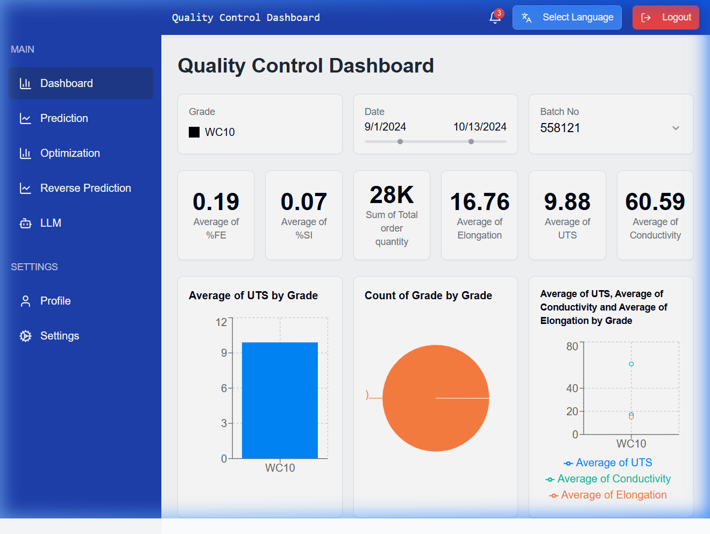
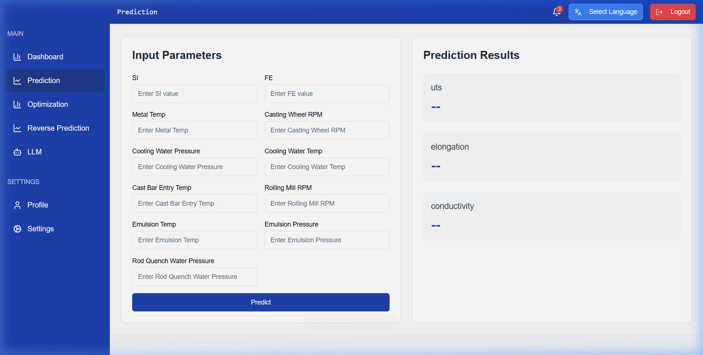
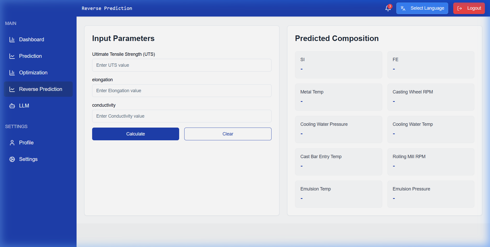
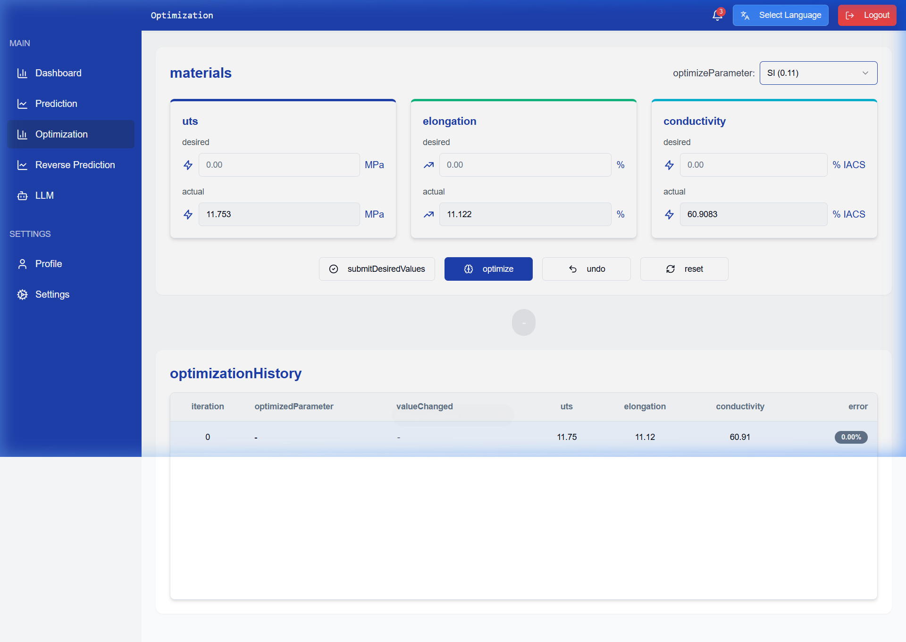
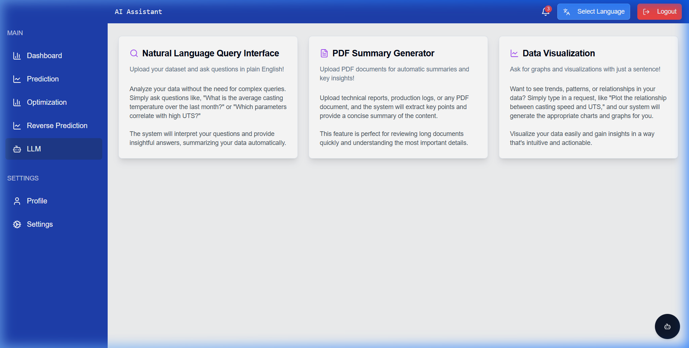
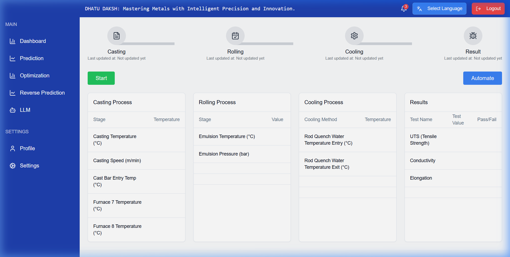

# NALCO SIH2024: Advanced Industrial Optmization Process Overview

A state-of-the-art industrial dashboard developed for **National Aluminium Company (NALCO)** to predict, analyze, and optimize material properties in the manufacturing process.

---

## 🎨 Dashboard Overview

### Quality Control & Process Monitoring
The central hub for real-time monitoring of key performance indicators (KPIs) like UTS, Elongation, and Conductivity.


### Predictive Analytics
Advanced ML models predict final material properties based on input production parameters (Si, Fe, Temperature, RPM, etc.).


### Reverse Engineering (Reverse Prediction)
Determine the necessary input production parameters to achieve specific desired material outputs.


### Bayesian Optimization
Fine-tune production parameters using Gaussian Process optimization to minimize error and hit target property ranges.


### AI-Powered Insights (LLM)
Interactive AI assistant capable of analyzing process data and providing actionable insights for engineers.


### Process Visualization
Full breakdown of the industrial workflow and parameter flow.


---

## 🚀 Key Features

- **Multi-Output Regression**: Simultaneously predicts UTS, Elongation, and Conductivity with high accuracy.
- **Dynamic Optimization**: Interactive Bayesian optimization to find the "Sweet Spot" for production settings.
- **Multilingual Support**: Fully localized dashboard for diverse operational teams.
- **Micro-Services Architecture**: Modular backend with dedicated APIs for prediction, reverse-prediction, and optimization.
- **Enterprise-Grade UI**: Built with React, Vite, and Tailwind CSS for a premium, high-performance experience.

---

## 🛠️ Tech Stack

- **Frontend**: React.js, TypeScript, Vite, Tailwind CSS, Shadcn/UI, Recharts.
- **Backend APIs**: FastAPI (Python), Flask.
- **Machine Learning**: Scikit-learn (RandomForest), Scipy, Skopt (Bayesian Optimization).
- **Data Handling**: Pandas, NumPy, Joblib.
- **Storage**: Git LFS (Large File Storage) for high-performance ML models.

---

## 📥 Installation & Setup

### 1. Prerequisites
- Python 3.10+
- Node.js & npm
- [Git LFS](https://git-lfs.github.com/) (Required to pull the ML models)

### 2. Clone and Initialize
```bash
git clone https://github.com/Abhinav-gupta-123/NALCO-SIH2024-project.git
cd NALCO-SIH2024-project
git lfs install
git lfs pull
```

### 3. Backend Setup
Install Python dependencies and start the API services:
```bash
pip install -r backend/requirements.txt

# Start Prediction API (Port 8000)
python backend/scripts/pred_main.py

# Start Reverse Prediction API (Port 8001)
python backend/scripts/rev_pred_main.py

# Start Optimization API (Port 8002)
python backend/scripts/optimization_main.py
```

### 4. Frontend Setup
```bash
cd dash-enhance-dashboard-82
npm install
npm run dev
```
Navigate to `http://localhost:8080` to access the dashboard.

---

## 🏗️ Project Structure

```text
├── backend/
│   ├── models/             # Trained .pkl models (via LFS)
│   └── scripts/            # FastAPI/Flask API implementations
├── dash-enhance-dashboard-82/
│   ├── src/
│   │   ├── pages/          # Dashboard modules (QC, Prediction, etc.)
│   │   └── components/     # High-fidelity UI components
├── docs/
│   └── screenshots/        # Visual documentation
└── README.md
```

---

*Developed for the National Aluminium Company (NALCO) as part of SIH 2024.*
